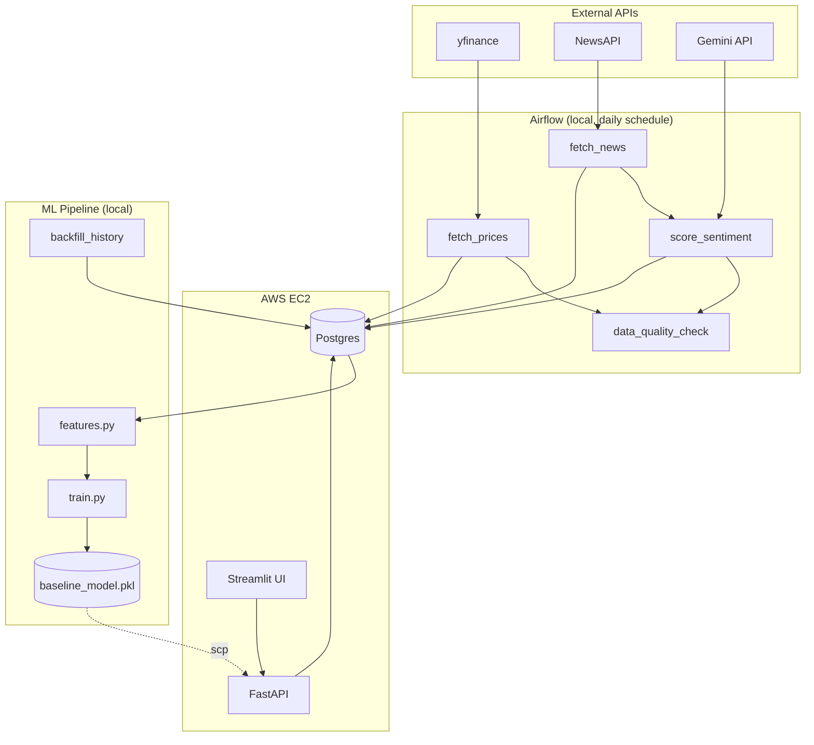

# StockSense
Daily-ingested S&P 500 prices + market news, scored for sentiment via Gemini, feeding a baseline ML model for next-day direction prediction — served through a FastAPI backend and a Streamlit dashboard.

Built as a hands-on learning project covering the full stack: Docker, Airflow, FastAPI, PostgreSQL, LLM-based feature engineering, and cloud deployment.

## Live Demo
- Dashboard: http://18.117.251.77:8501/
- API docs: http://18.117.251.77:8000/docs
## Screenshots: 
See in folder screenshots

## Architecture



## Results
Model (with Gemini-scored news sentiment) vs. naive "always predict up" baseline:
- Naive baseline accuracy: 0.537
- Model accuracy: 0.529
- Model precision: 0.538
- Model recall: 0.865

## Tech Stack
Python · PostgreSQL · Apache Airflow · FastAPI · Streamlit · scikit-learn ·
Gemini API · Docker · Docker Compose · AWS EC2 · GitHub Actions

## Running Locally
See `stocksense-runbook.md` for full startup/shutdown instructions.

Quick start:
```powershell
docker compose up -d --build
```
Then: Airflow at localhost:8080, API at localhost:8000/docs, UI at localhost:8501.
